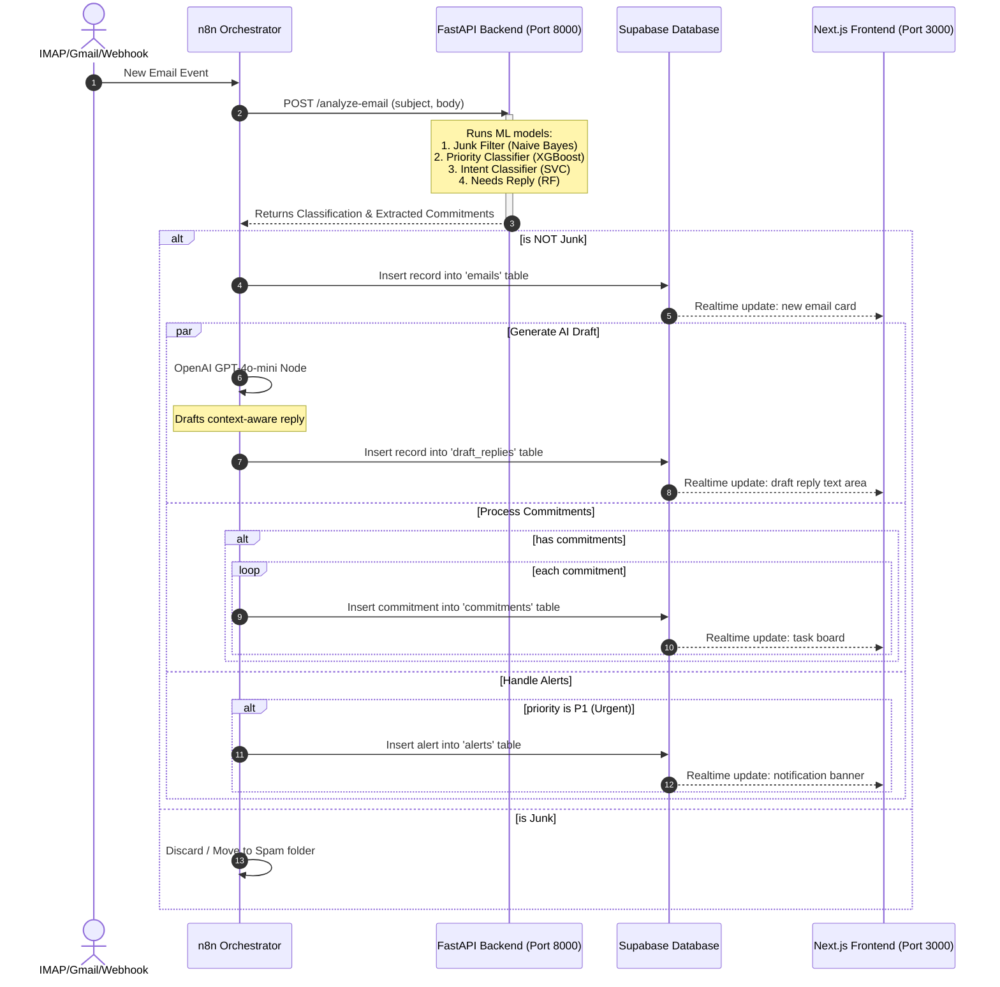

# REPLYNT: Core n8n Triage & Orchestration Pipeline

This document details the **n8n Orchestration Pipeline**, which serves as the central nervous system of **REPLYNT**. The automation coordinates data movement between incoming email channels, the FastAPI Machine Learning backend, the Supabase database layer, and Next.js frontend realtime updates.

---

## 1. System Architecture

The workflow below details how the n8n pipeline processes incoming emails:



---

## 2. n8n Workflow Configuration

The complete n8n workflow schema is stored in the repository at [`automation/n8n_replynt_workflow.json`](file:///c:/Users/soumy/OneDrive/Desktop/Replynt/Replynt/automation/n8n_replynt_workflow.json).

### Key Pipeline Nodes & Logic

1. **Email / Webhook Trigger**: Captures raw emails. Can be configured to hook into Gmail, IMAP, or standard HTTP Webhooks.
2. **FastAPI Classifier Integration**:
   - URL: `http://localhost:8000/analyze-email`
   - Content-Type: `application/json`
   - Payload:
     ```json
     {
       "subject": "={{ $json.body.subject }}",
       "body": "={{ $json.body.text }}"
     }
     ```
3. **Junk Filtering Node**:
   - Conditional expression: `{{ $json.junk }} == true`
   - Prevents spam or non-operational mail from cluttering Supabase and consuming OpenAI tokens.
4. **Supabase Connectors**:
   - Inserts record details into `emails` with calculated `risk_score` and `priority`.
   - Populates `commitments` dynamically based on regex-extracted promises returned by the ML backend.
   - Pushes urgent notifications to the `alerts` table for immediate UI highlight.
5. **AI Auto-Responder Draft Node**:
   - Model: `gpt-4o-mini`
   - Prompt Context: Injects email subject, body, sender, FastAPI classified intent, and priority for customized, context-rich responses.

---

## 3. Database Schema (Supabase)

To support the automation and Next.js frontend, run the SQL script located at [`automation/supabase_setup.sql`](file:///c:/Users/soumy/OneDrive/Desktop/Replynt/Replynt/automation/supabase_setup.sql) in your Supabase SQL Editor.

The schema details are as follows:

| Table | Description | Primary Key | Key Relationships |
| :--- | :--- | :--- | :--- |
| `emails` | Contains processed emails and their metadata (priority, intent, risk). | `id` (UUID) | None |
| `commitments` | Tracks tasks and commitments extracted from emails. | `id` (UUID) | `email_id` (References `emails.email_id`) |
| `alerts` | Stores high-priority notifications for P1 emails. | `id` (UUID) | `email_id` (References `emails.email_id`) |
| `draft_replies` | Stores the AI-generated responses for review. | `id` (UUID) | `email_id` (References `emails.email_id`) |

---

## 4. Local Deployment & Run Instructions

### Prerequisites
1. **Python 3.10+** (Backend)
2. **Node.js 18+** (Frontend)
3. **Supabase Account** (Database & Realtime PubSub)
4. **n8n Instance** (Orchestrator - Cloud or local npm/Docker package)

### Step 1: Run the ML Backend
```bash
cd backend
python -m venv .venv
# On Windows PowerShell:
.venv\Scripts\activate.ps1
# Install dependencies:
pip install -r requirements.txt
# Launch FastAPI:
uvicorn app.main:app --host 0.0.0.0 --port 8000 --reload
```
Open API Docs at [http://127.0.0.1:8000/docs](http://127.0.0.1:8000/docs) to verify readiness.

### Step 2: Configure & Launch Frontend
1. Create a `.env.local` inside the `frontend` folder:
   ```env
   NEXT_PUBLIC_SUPABASE_URL=your-supabase-project-url
   NEXT_PUBLIC_SUPABASE_ANON_KEY=your-supabase-anon-key
   NEXT_PUBLIC_API_URL=http://localhost:8000
   ```
2. Build and run:
   ```bash
   cd frontend
   npm install
   npm run dev
   ```
   Open dashboard at [http://localhost:3000](http://localhost:3000).

### Step 3: Set Up n8n
1. Open your n8n workspace.
2. Click **Import from File...** and select `automation/n8n_replynt_workflow.json`.
3. Configure your node credentials (OpenAI API key and Supabase URL/API key).
4. Save and activate the workflow.
