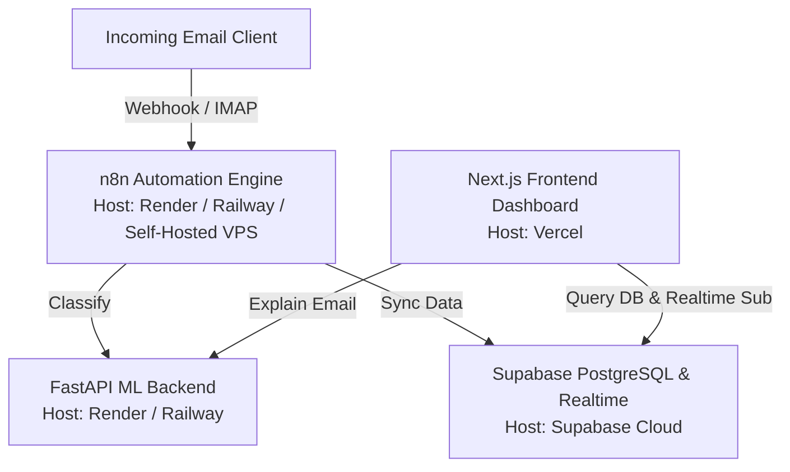

# REPLYNT: Full-Stack Production Deployment Guide

This guide explains how to deploy the **REPLYNT** platform to production. Since the application is composed of multiple service layers, we will host them using specialized cloud providers that offer free or cost-effective plans.

---

## 🏗️ Production Architecture Overview



---

## 🗄️ Step 1: Deploy the Database (Supabase)

Supabase is already cloud-hosted, making it ready for production.

1. Create a production project in the [Supabase Dashboard](https://supabase.com).
2. Go to the **SQL Editor** in your new project.
3. Paste and run the schema setup from [`automation/supabase_setup.sql`](file:///c:/Users/soumy/OneDrive/Desktop/Replynt/Replynt/automation/supabase_setup.sql) to initialize your tables (`emails`, `commitments`, `alerts`, `draft_replies`) and configure realtime replication.
4. Copy your database credentials from **Project Settings > API**:
   - `Project URL`
   - `anon public API Key`
   - `service_role secret API Key` (for n8n database write permissions)

---

## 🐍 Step 2: Deploy the FastAPI Backend (Render)

We will use **Render** (render.com) to host the Python FastAPI classification server.

1. Sign up on [Render](https://render.com) and link your GitHub account.
2. Click **New + > Web Service**.
3. Select the `Replynt` repository.
4. Configure the Web Service settings:
   - **Name**: `replynt-backend`
   - **Root Directory**: `backend`
   - **Environment**: `Python 3`
   - **Build Command**: `pip install -r requirements.txt`
   - **Start Command**: `uvicorn app.main:app --host 0.0.0.0 --port $PORT`
   - **Plan**: Free (or Starter if you want to bypass sleep/cold starts)
5. Under **Environment Variables**, add:
   - `CORS_ALLOW_ORIGINS`: `["https://your-frontend-domain.vercel.app"]` (once you deploy the frontend, update this to restrict access to only your dashboard).
6. Click **Deploy Web Service**. Render will install dependencies, download your pre-trained ML pipelines (`.pkl` files), and provide a public URL like `https://replynt-backend.onrender.com`.

---

## 💻 Step 3: Deploy the Frontend (Vercel)

We will use **Vercel** (vercel.com) to deploy the Next.js frontend, as it is the native host for Next.js and handles server-side rendering and edge optimizations.

1. Sign up on [Vercel](https://vercel.com) and import the `Replynt` repository.
2. Configure the project:
   - **Root Directory**: Select `frontend`.
   - **Framework Preset**: `Next.js`.
3. Add the following **Environment Variables**:
   - `NEXT_PUBLIC_SUPABASE_URL`: (Your production Supabase Project URL)
   - `NEXT_PUBLIC_SUPABASE_ANON_KEY`: (Your production Supabase Anon public key)
   - `NEXT_PUBLIC_API_URL`: (Your public Render backend URL, e.g., `https://replynt-backend.onrender.com`)
4. Click **Deploy**. Vercel will compile the Next.js app and host it on a public domain (e.g., `https://replynt.vercel.app`).
5. **Important**: Go back to Render's backend settings and update the `CORS_ALLOW_ORIGINS` variable to match this frontend URL, then trigger a redeploy of the backend.

---

## 🤖 Step 4: Deploy the n8n Automation Engine

For n8n, you have three options depending on your budget:

### Option A: Render or Railway (Recommended, Low Cost/Free)
You can deploy n8n using its official Docker image.
1. Create a **New Service** on Render or Railway.
2. Select **Docker** or deploy from a public image: `docker.io/n8nio/n8n:latest`.
3. Expose port `5678`.
4. Define the following environment variables:
   - `N8N_ENCRYPTION_KEY`: (A random secure string)
   - `WEBHOOK_URL`: (The URL Render/Railway provides for your n8n instance)
5. Once running, open the dashboard, click **Import from File...**, and load [`automation/n8n_replynt_workflow.json`](file:///c:/Users/soumy/OneDrive/Desktop/Replynt/Replynt/automation/n8n_replynt_workflow.json).

### Option B: Self-Hosted VPS (Hetzner / DigitalOcean - ~$4/mo)
Deploy n8n inside a Docker container on a Linux VPS for maximum reliability:
```bash
docker run -d --name n8n -p 5678:5678 -v ~/.n8n:/home/node/.n8n -e N8N_ENCRYPTION_KEY=your_key n8nio/n8n
```
Set up a reverse proxy using Nginx or Caddy to enable HTTPS.

### Option C: n8n Cloud (Easiest, Paid)
1. Sign up for a free trial on [n8n.io](https://n8n.io/).
2. Create a workflow, click the top right settings icon, select **Import from File...**, and import the workflow JSON.

---

## 🔌 Step 5: Connecting the Components

Once all platforms are deployed:
1. In the n8n Workflow, open the **Call FastAPI Backend** HTTP node and update the URL to your production Render URL: `https://your-backend.onrender.com/analyze-email`.
2. Update the **Supabase** credentials in n8n to connect to your production Supabase database.
3. Configure the trigger node in n8n (e.g., IMAP or Gmail Node) to point to the production email inbox you wish to automate.
4. Toggle the workflow to **Active** in n8n.
