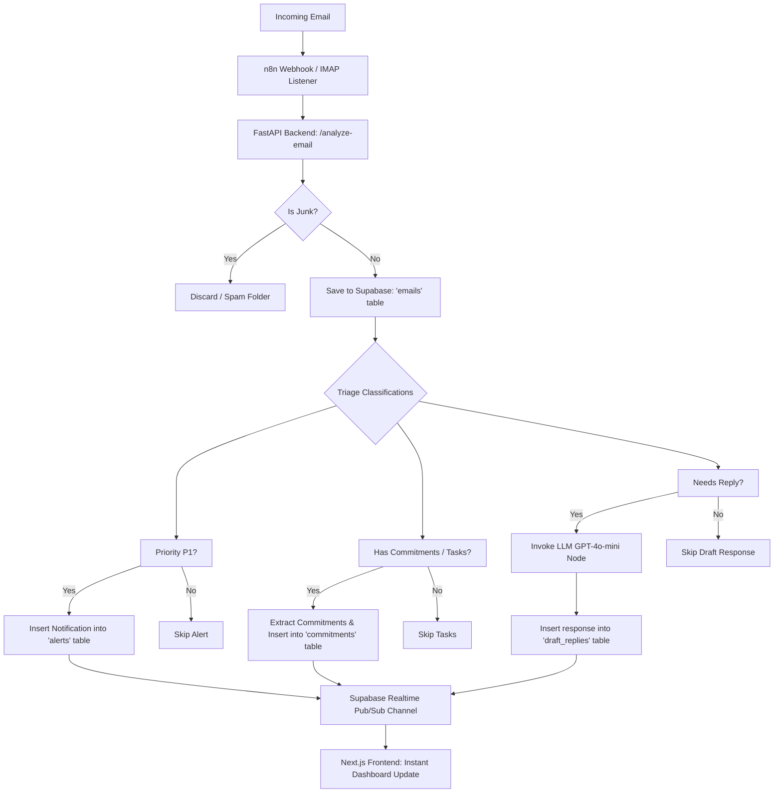

# REPLYNT: Intelligent Email Triage & Automation Pipeline

REPLYNT is an enterprise-grade email automation, triage, and intelligence platform. It analyzes incoming business emails using custom Machine Learning models, classifies their priority/intent/junk status, extracts operational commitments (deadlines and action items), drafts AI responses, and displays everything on a realtime Next.js dashboard.

---

## 🚀 Key Highlights & Contributors

REPLYNT was built as a collaborative engineering effort:
* **Madhuparna Bera** — Lead Machine Learning & Data Scientist (Developed and trained pipelines for Junk Detection, Priority Classification, Intent Detection, and Needs Reply Prediction).
* **Trisha Jana ([@21trishajana](https://github.com/21trishajana))** — Lead DevOps, Database, & Automation Engineer (Designed and built the n8n automation pipelines, Supabase database schemas, realtime Pub/Sub synchronization, and Next.js frontend integration).

---

## 🛠️ System Architecture

REPLYNT consists of four main systems working in sync:

1. **FastAPI Machine Learning Backend**:
   A high-performance REST API that loads four pre-trained ML models (`joblib`) to classify emails in real time.
2. **Next.js Realtime Frontend Dashboard**:
   A dashboard showing incoming emails, classified tags, pending commitments, alerts, and AI-generated drafts.
3. **n8n Automation Engine**:
   The workflow automation pipeline that hooks into email providers, invokes the ML backend, writes results to Supabase, triggers LLM nodes for reply drafting, and coordinates email notifications.
4. **Supabase Realtime Cloud DB**:
   Serves as the database layer with Row-Level Security and PostgreSQL Realtime replication, allowing the frontend to update instantly when new emails or drafts are processed by n8n.

For a detailed view of the n8n pipeline nodes and database sequence diagrams, see [AUTOMATION.md](file:///c:/Users/soumy/OneDrive/Desktop/Replynt/Replynt/AUTOMATION.md).

---

## 🔄 End-to-End Project Flow

REPLYNT automates the entire lifecycle of an email from receipt to response:



### Detailed Flow Steps:
1. **Email Ingestion**: The system monitors incoming emails via `n8n` triggers (IMAP polling or Webhook inputs).
2. **Machine Learning Analysis**: The email text is forwarded to the FastAPI backend. It runs:
   - **Junk Filtering** (Naive Bayes) to filter spam.
   - **Priority Classification** (XGBoost) to assign urgency (P1, P2, P3).
   - **Intent Classification** (SVC) to detect subject matter (e.g., Billing, Support, Complaint).
   - **Needs Reply Prediction** (Random Forest) to determine if a reply is expected.
3. **Database Insertion**: Classified emails are saved in the Supabase PostgreSQL database.
4. **Conditional Automation Pathways**:
   - **High Urgency**: If the email is P1, an instant alert is logged.
   - **Task Extraction**: Any promises or deadlines (like "I will send it by Friday") are parsed, and a tracking task is added.
   - **AI Reply Drafting**: For emails requiring a response, n8n invokes GPT-4o-mini to draft a context-aware reply using the intent and email content.
5. **Realtime Web Dashboard**: Supabase triggers active listening channels in Next.js, instantly updating the UI with new cards, draft boxes, and alert banners without requiring a browser refresh.

---

## 📁 Repository Structure

```text
Replynt/
├── backend/            # FastAPI REST API & classification server
│   ├── app/            # Source code for endpoints, services, & utilities
│   └── requirements.txt# Python package dependencies
├── frontend/           # Next.js App Router Web UI
│   ├── app/            # Client dashboard pages (inbox, tasks, alerts)
│   ├── components/     # UI components (glassmorphism, interactive elements)
│   └── package.json    # Node.js dependencies & scripts
├── automation/         # n8n workflow configurations & database schemas
│   ├── n8n_replynt_workflow.json  # Complete n8n workflow export
│   └── supabase_setup.sql          # DB initialization SQL script
├── models/             # Serialized joblib ML pipelines (.pkl files)
└── notebooks/          # Jupyter notebooks used for training & data analysis
```

---

## ⚙️ Quick Start

### 1. Database Setup
1. Log in to your [Supabase Console](https://supabase.com).
2. Create a new project.
3. Navigate to the SQL Editor and paste the contents of [`automation/supabase_setup.sql`](file:///c:/Users/soumy/OneDrive/Desktop/Replynt/Replynt/automation/supabase_setup.sql). Run the script to initialize the tables and enable realtime updates.

### 2. Run the Machine Learning Backend
```bash
cd backend
python -m venv .venv
# Activate virtualenv (Windows):
.venv\Scripts\activate.ps1
# Install packages:
pip install -r requirements.txt
# Run:
uvicorn app.main:app --host 0.0.0.0 --port 8000 --reload
```
API Documentation will be active at [http://127.0.0.1:8000/docs](http://127.0.0.1:8000/docs).

### 3. Run the Next.js Frontend Dashboard
1. Create a `.env.local` file inside the `frontend` folder:
   ```env
   NEXT_PUBLIC_SUPABASE_URL=your_supabase_url
   NEXT_PUBLIC_SUPABASE_ANON_KEY=your_supabase_anon_key
   NEXT_PUBLIC_API_URL=http://localhost:8000
   ```
2. Build and run:
   ```bash
   cd ../frontend
   npm install
   npm run dev
   ```
The dashboard will be active at [http://localhost:3000](http://localhost:3000).

### 4. Deploy the n8n Workflow
1. Start your local or cloud n8n instance.
2. Select **Import from File...** and load [`automation/n8n_replynt_workflow.json`](file:///c:/Users/soumy/OneDrive/Desktop/Replynt/Replynt/automation/n8n_replynt_workflow.json).
3. Connect your OpenAI credentials (for GPT-4o-mini drafting) and Supabase credentials.
4. Activate the workflow to begin processing emails.
